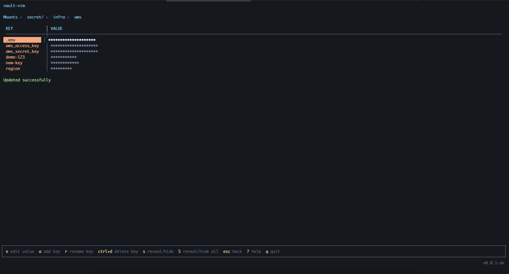

# vault-vim

A terminal UI for HashiCorp Vault KV v2 secrets. Browse, view, edit, and manage secrets without remembering CLI commands. 

No more accidental:
- having hard time to remember commands. We are fucking old already (My colleague HieuPN said that xD)
- overwrites with `vault kv put`.



## Install

### Download binary

Download the latest release from [GitHub Releases](https://github.com/BlackMetalz/vault-vim/releases/latest):

```bash
# Linux amd64
curl -Lo vault-vim https://github.com/BlackMetalz/vault-vim/releases/latest/download/vault-vim-linux-amd64
chmod +x vault-vim
sudo mv vault-vim /usr/local/bin/

# macOS Apple Silicon (M1/M2/M3)
curl -Lo vault-vim https://github.com/BlackMetalz/vault-vim/releases/latest/download/vault-vim-darwin-arm64
chmod +x vault-vim
sudo mv vault-vim /usr/local/bin/

# macOS Intel
curl -Lo vault-vim https://github.com/BlackMetalz/vault-vim/releases/latest/download/vault-vim-darwin-amd64
chmod +x vault-vim
sudo mv vault-vim /usr/local/bin/
```

### Build from source

```bash
go install github.com/BlackMetalz/vault-vim@latest
```

## Quick Start

```bash
# Set your Vault connection (or use 'vault login' which writes ~/.vault-token)
export VAULT_ADDR=http://127.0.0.1:8200
export VAULT_TOKEN=your-token
vault-vim
```

## Local Dev with Docker

```bash
# Start local Vault with test data
make dev-up

# Build + run against local Vault (auto-sets env vars)
make dev

# Cleanup
make dev-down
```

Test data includes:
- `secret/myapp/prod|staging|dev` — DB credentials
- `secret/infra/aws|gcp` — cloud keys
- `team-secrets/backend/api-keys` — API keys
- `team-secrets/frontend/config` — frontend config
- Test user: `testuser` / `testpass`

## Make Commands

| Command       | Description                                      |
|---------------|--------------------------------------------------|
| `make local`  | Run tests, build, and run                        |
| `make build`  | Run tests and build binary                       |
| `make test`   | Run unit tests                                   |
| `make dev-up` | Start local Vault with test data                 |
| `make dev`    | Build + run against local dev Vault              |
| `make dev-down` | Stop local Vault                               |
| `make clean`  | Remove binary                                    |

## Navigation (Mounts & Browser)

| Key     | Action              |
|---------|---------------------|
| `up/down`   | Move up/down       |
| `enter` | Open / drill in    |
| `n`     | Create new secret  |
| `esc`   | Go back            |
| `/`     | Filter items       |
| `q`     | Quit               |

## Secret View

| Key      | Action              |
|----------|---------------------|
| `up/down`    | Move up/down       |
| `e`      | Edit value         |
| `a`      | Add new key        |
| `r`      | Rename key         |
| `ctrl+d` | Delete key         |
| `s`      | Reveal/hide value  |
| `S`      | Reveal/hide all    |
| `esc`    | Back to browser    |
| `q`      | Quit               |

## Editor

Full-screen text editor using [bubbles/textarea](https://github.com/charmbracelet/bubbles). Supports multiline values and paste (cmd+v / ctrl+v).

| Key        | Action              |
|------------|---------------------|
| `ctrl+s`   | Save changes       |
| `F2`       | Save changes (alt) |
| `esc`      | Cancel             |
| `enter`    | New line           |
| `ctrl+d`   | Delete line        |
| `ctrl+a`   | Go to line start   |
| `ctrl+e`   | Go to line end     |
| `arrows`   | Move cursor        |

## How It Works

- **Browse**: Lists KV v2 mount points, then paths within each mount
- **View**: Shows all key-value pairs in a table (masked by default)
- **Edit**: Uses `vault kv patch` — only updates the field you changed, never overwrites other keys
- **Add key**: Appends a new key to an existing secret via `patch`
- **Rename key**: Reads secret, copies value to new key, deletes old key
- **Delete key**: Reads secret, removes the key, writes back
- **Create secret**: Creates a new secret path with a placeholder key
- **Auth**: Reads `VAULT_TOKEN` env var or `~/.vault-token` (written by `vault login`)
